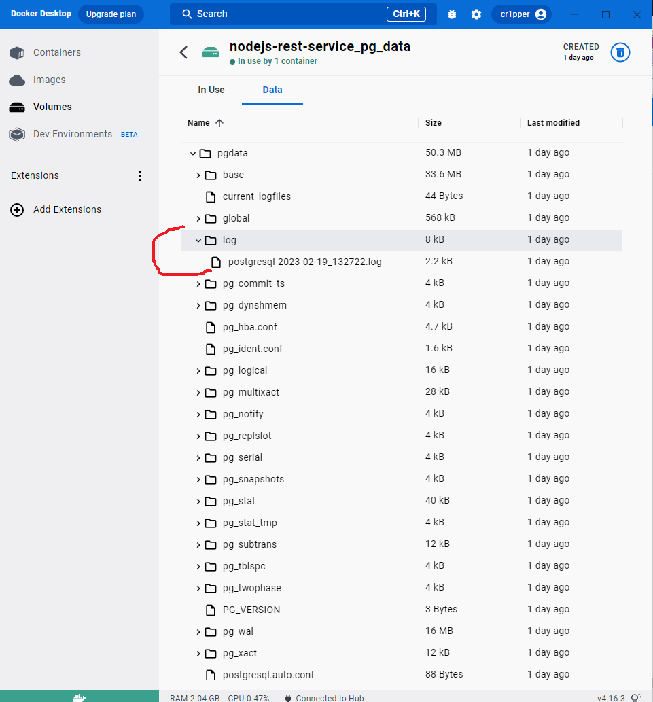
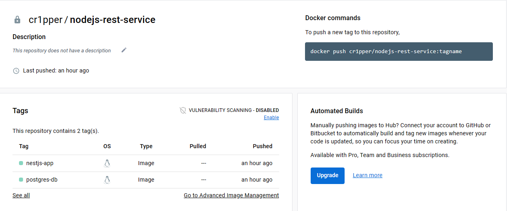

# Home Library Service

## Prerequisites

- Git - [Download & Install Git](https://git-scm.com/downloads).
- Node.js - [Download & Install Node.js](https://nodejs.org/en/download/) and the npm package manager.
- Docker - [Download & Install Docker](https://www.docker.com/products/docker-desktop/).

## Downloading

```bash
git clone {repository URL}
```

## Installing NPM modules

```bash
npm install
```

## Running application

Go to `.env` file and change values of environment variables if needed. There are default values.

To run application type:
```bash
docker compose up -d
```

After starting the `app` on contaner you will see in docker image logs:
```
Starting compilation in watch mode...
``` 
You have to wait until compilation is finished. When it finish you'll see in docker image logs:
```
[Nest] LOG [NestApplication] Nest application successfully started
```
After than you can run tests or work with API in browser or Postman. 

To view the API documentation, type http://localhost:4000/doc/ in browser.

For more information about OpenAPI/Swagger please visit https://swagger.io/.

## Scan images for security vulnerability

```bash
npm run vulnerability:scan
```

## Postgres logs



## Docker Images 



## Testing

After application running open new terminal and enter:

To run all tests without authorization

```bash
npm run test
```

To run only one of all test suites

```bash
npm run test -- <path to suite>
```

To run all test with authorization

```bash
npm run test:auth
```

To run only specific test suite with authorization

```bash
npm run test:auth -- <path to suite>
```

### Auto-fix and format

```bash
npm run lint
```

```bash
npm run format
```

### Debugging in VSCode

Press <kbd>F5</kbd> to debug.

For more information, visit: https://code.visualstudio.com/docs/editor/debugging
